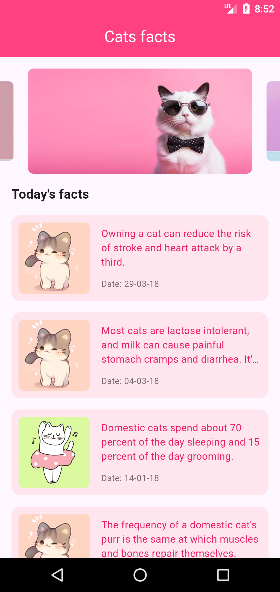
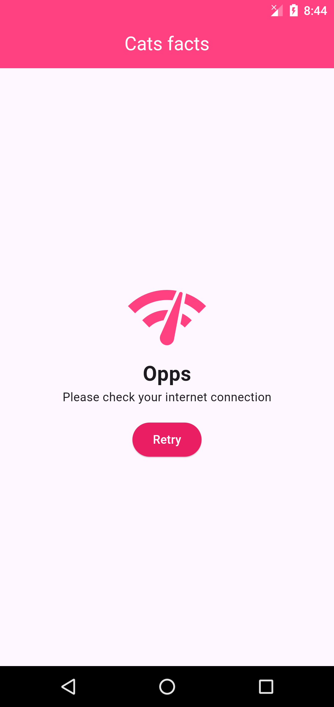

# flutter_cat_fact_app

Welcome to the **Flutter Clean Architecture** project! This Flutter application demonstrates the implementation of Clean Architecture principles combined with BLoC for state management, GetIt for dependency injection, and HTTP for network calls.

 

## Project Structure

This project is structured to follow the principles of Clean Architecture, ensuring that the codebase remains modular, testable, and maintainable. Here's a brief overview of the key components:

- **Core**: Contains essential classes and utilities used throughout the project.
- **Data**: Manages data sources and repositories, handling network calls and local storage.
- **Domain**: Defines business logic and entities, including use cases and abstract repositories.
- **Presentation**: Implements the user interface and state management using BLoC.

## Key Features

- **Clean Architecture**: Separation of concerns with distinct layers for presentation, domain, and data.
- **BLoC for State Management**: Efficiently manage and react to state changes using the BLoC (Business Logic Component) pattern.
- **GetIt for Dependency Injection**: Simplify dependency management and improve testability with GetIt.
- **HTTP for Network Calls**: Handle network requests and responses with the HTTP package.

A few resources to get you started if this is your first Flutter project:

- [Lab: Write your first Flutter app](https://docs.flutter.dev/get-started/codelab)
- [Cookbook: Useful Flutter samples](https://docs.flutter.dev/cookbook)

For help getting started with Flutter development, view the
[online documentation](https://docs.flutter.dev/), which offers tutorials,
samples, guidance on mobile development, and a full API reference.
